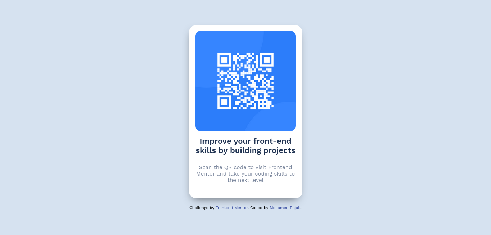

# Frontend Mentor - QR code component solution

This is a solution to the [QR code component challenge on Frontend Mentor](https://www.frontendmentor.io/challenges/qr-code-component-iux_sIO_H). Frontend Mentor challenges help you improve your coding skills by building realistic projects. 

### Screenshot

### Links

- Solution URL: [Add solution URL here](https://your-solution-url.com)
- Live Site URL: [Add live site URL here](https://your-live-site-url.com)

## My process

### Built with

- Semantic HTML5 markup
- CSS custom properties
- Flexbox
- Responsive Design

### What I learned

Very easy project for someone who recently stepped in the world of development!

## Author

- Frontend Mentor - [@mohamedRajab0](https://www.frontendmentor.io/profile/mohamedRajab0)
- Twitter - [@elzaimmohamed](https://www.twitter.com/elzaimmohamed)

**Note: Delete this note and add/remove/edit lines above based on what links you'd like to share.**

## Acknowledgments

A big thank you to anyone providing feedback on my solution. It definitely helps to find new ways to code and find easier solutions!
